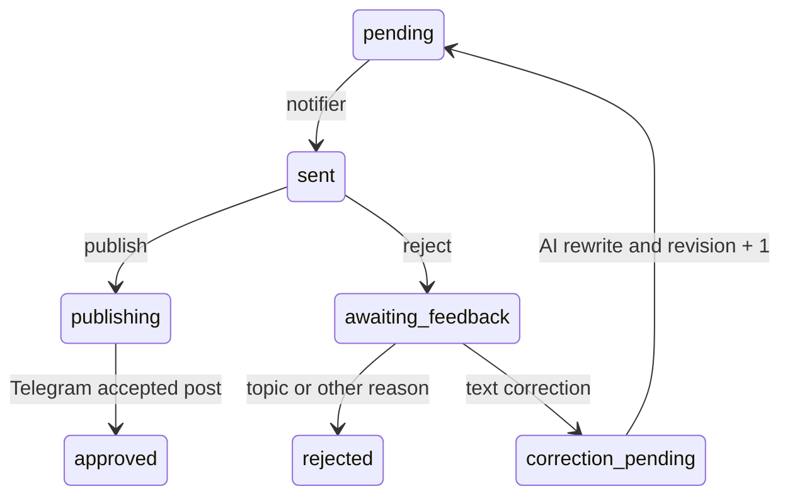

# Editorial feedback loop

The editor queue is a versioned state machine. Telegram only collects the
decision and comment; `analyzer.py` remains the single place that calls OpenAI
and accounts for its cost.

## Feedback types

- `text_correction`: the editor comment is used to rewrite the current draft
  against the source article. The corrected draft is requeued with a new
  revision number.
- `topic_mismatch`: the rejected draft and editor comment become a negative
  example for future relevance decisions.
- `other_rejection`: the reason is stored for audit, but never changes topic
  selection.
- `approved`: recorded automatically as a positive example to keep negative
  feedback from becoming an overly broad topic ban.

Only callbacks for the latest queue revision and Telegram message are accepted.
Database functions claim and apply corrections atomically, so overlapping
scheduled jobs cannot process the same correction twice.
