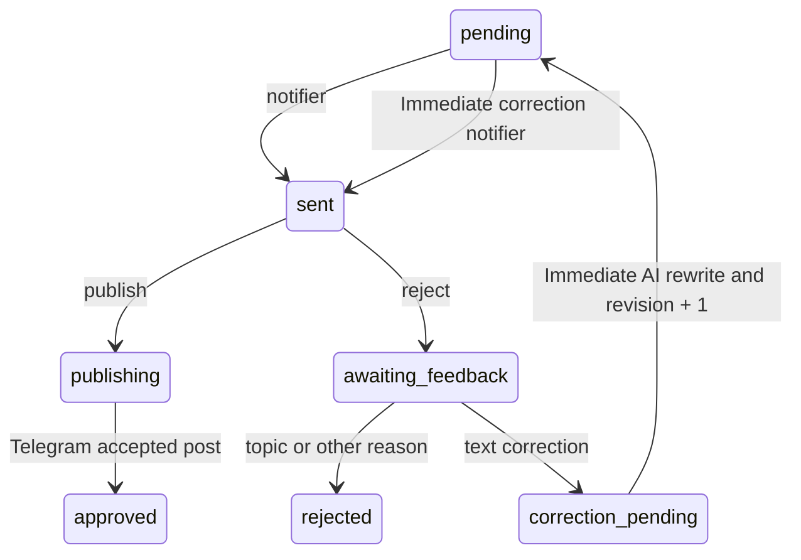

# Editorial feedback loop

The editor queue is a versioned state machine. Telegram only collects the
decision and comment; `analyzer.py` remains the single place that calls OpenAI
and accounts for its cost.

## Feedback types

+ `text_correction`: the editor comment is used to rewrite the current draft
  against the source article. A dedicated workflow is dispatched immediately;
  it requeues the corrected draft with a new revision and sends that version
  straight back to this Telegram editor chat. The publication buttons remain,
  so the editor still approves or rejects the corrected version.
- `topic_mismatch`: the rejected draft and editor comment become a negative
  example for future relevance decisions.
- `other_rejection`: the reason is stored for audit, but never changes topic
  selection.
- `approved`: recorded automatically as a positive example to keep negative
  feedback from becoming an overly broad topic ban.

Only callbacks for the latest queue revision and Telegram message are accepted.
Database functions claim and apply corrections atomically, so overlapping
scheduled jobs cannot process the same correction twice. The notifier claims a
pending queue row before sending it, so an immediate correction and the regular
pipeline cannot deliver the same revision twice.

## Next-news navigation

Telegram bots cannot control the editor's mobile scroll position or restore the
client's unread markers. After an approval or a non-correction rejection, the
bot therefore offers `⏭ Следующая новость` at the bottom of the chat. The
button selects the next still-`sent` candidate by its Telegram message order,
copies it to the bottom with the normal publication buttons, and makes that
copy the active callback message. If no unresolved candidate exists below the
current card, navigation wraps to the nearest unresolved candidate above it.
Only when no already-sent candidate remains is the oldest `pending` row claimed
and sent immediately. `/next` provides the same action without a button.

When a candidate is copied, the previous card is marked as moved. If Telegram
cannot update an older card, clicking that visible copy reactivates it as long
as the queue revision is still current and no final decision has been recorded.

Text-correction comments do not advance automatically: the corrected revision
must arrive and remain subject to manual approval, preserving the immediate
correction workflow.
